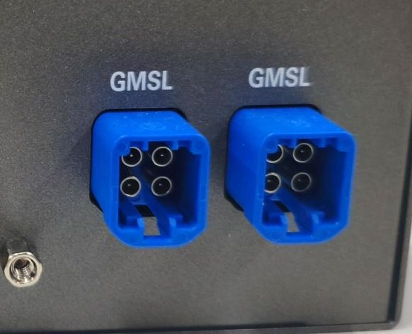
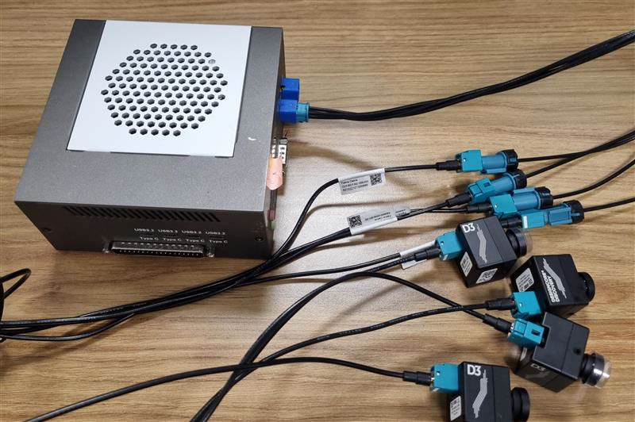
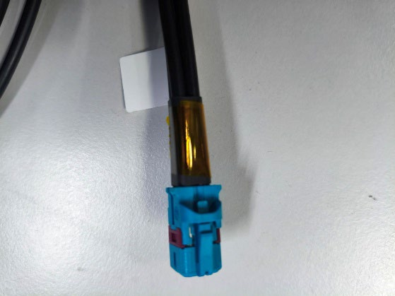

# GMSL

This guide covers connecting and configuring a GMSL camera using the Robinson Bay FAKRA ports.

:::note Prerequisite
The kit must be running a supported Ubuntu release with the Intel kernel overlay and the IPU camera stack installed. Ensure you have completed the [Operating System](../../../../../os-setup/index.md) before continuing.
:::

## 1. Physical Connection

The GMSL deserializers are **built into the kit**, so you connect the camera straight to a GMSL port with a FAKRA cable — no external deserializer board is needed.

Six GMSL cameras are enabled on the kit:
- Cameras **1, 2, 3, 4** connect to **GMSL Port 1** using the standard FAKRA 4-in-1 cable.
- Cameras **6, 7** connect to **GMSL Port 2** using the taped FAKRA 4-in-1 cable.

The camera number printed on the port corresponds to the `icamerasrc` `device-name` suffix (e.g., `device-name=ar0234-1` for camera 1).




:::caution
The taped cable blocks cameras **5 and 8** — only **1, 2, 3, 4, 6, 7** are usable.
:::


## 2. Software Configuration

### Install the sensor driver (DKMS)

From the camera's driver package (provided by the camera vendor), build and install the sensor and SerDes kernel modules:

```bash
sudo dkms remove ipu-camera-sensor/0.1 || true
sudo rm -rf /usr/src/ipu-camera-sensor-0.1/

sudo dkms add .
sudo dkms build -m ipu-camera-sensor -v 0.1
sudo dkms install -m ipu-camera-sensor -v 0.1 --force
```

### Describe the wiring to the kernel

For GMSL, the camera topology is described through an ACPI **SSDT** table. You must compile the topology description (matching your specific camera's serializer and sensor I2C addresses) and load it into the bootloader:

```bash
./gen_ssdt.sh <topology>.asl
sudo update-grub
sudo reboot
```

After reboot, initialize the media graph:
```bash
sudo ./mc-setup.sh
media-ctl -p
```

## Next Steps

Now that your GMSL camera is physically connected and the base driver is loaded, go to the **[GMSL Camera Catalog](/docs/sensors/cameras/gmsl)**. Select your specific sensor model to:
1. Find its specific I2C addresses for the SSDT.
2. Install its `ipu75xa` configuration files into `/etc/camera`.
3. Get the exact `icamerasrc` GStreamer pipeline command to stream video.
