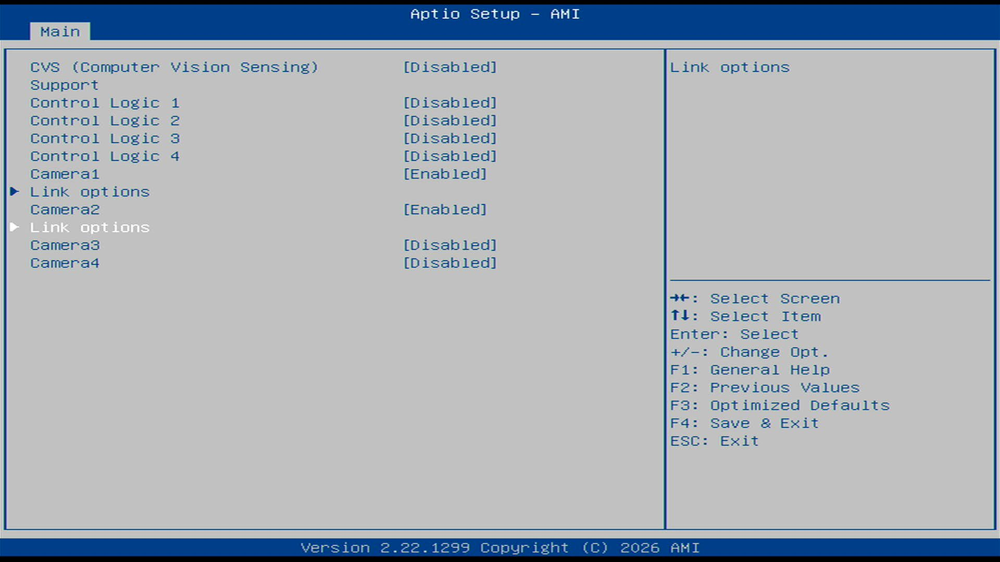
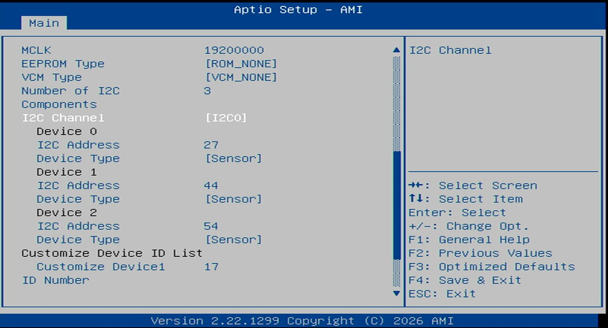

# MIPI CSI-2

This guide covers connecting and configuring a MIPI CSI-2 camera directly to the Robinson Bay CSI headers.

:::note Prerequisite
The kit must be running a supported Ubuntu release with the Intel kernel overlay and the IPU camera stack installed. Ensure you have completed the [Operating System](../../../../../os-setup/index.md) before continuing.
:::

## 1. Physical Connection

Connect the sensor to one of the kit's three **CSI connectors**.

**CPHY vs. DPHY:** Robinson Bay provides **CPHY** MIPI connectors. Check your specific camera in the catalog — if your camera is DPHY (which is common), you must use a **CPHY–DPHY adapter**. 
* Plug the DPHY sensor into the **front** of the adapter.
* Plug the **rear** of the adapter into the kit.

## 2. BIOS Configuration

Unlike GMSL which uses SSDT tables loaded at boot time, MIPI cameras are configured directly in the BIOS.

1. Reboot and press **`ESC`** to enter the BIOS.
2. Navigate to **System I/O** > **MIPI Camera Configuration**.
3. Enable the camera port you are using:
   * **Camera1** controls MIPI Port 0.
   * **Camera2** controls MIPI Port 2.

   
   

4. Instead of standard sensors, add the sensor as a **User Custom** camera. You will enter the **Custom HID**, I2C address, and lane mapping found on your camera's catalog page.
5. Save and exit the BIOS.

## 3. Software Configuration

From the camera's driver package (provided by the camera vendor), build and install the sensor kernel modules:

```bash
sudo dkms remove ipu-camera-sensor/0.1 || true
sudo rm -rf /usr/src/ipu-camera-sensor-0.1/

sudo dkms add .
sudo dkms build -m ipu-camera-sensor -v 0.1
sudo dkms install -m ipu-camera-sensor -v 0.1 --force
```

## Next Steps

Now that your MIPI camera is physically connected and configured in BIOS, go to the **[MIPI CSI-2 Camera Catalog](/docs/sensors/cameras/mipi-csi-2)**. Select your specific sensor model to:
1. Find the Custom HID and I2C values required for the BIOS step.
2. Install its `ipu75xa` configuration files into `/etc/camera`.
3. Get the exact `icamerasrc` GStreamer pipeline command to stream video.
