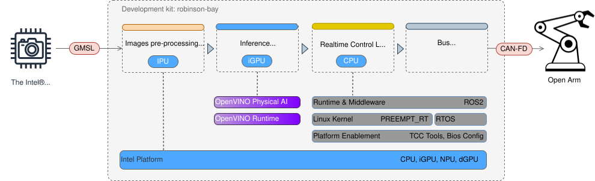

# Stationary Arm

This blueprint shows how to bring up a fixed-base robot arm on Intel hardware
and run a pick task from a camera feed with a trained policy. It covers the full path from bare
hardware to a working application.

*Figure 1 — OpenArm: a 7-DOF arm with 606 mm reach, 6.0 kg peak payload per arm, and 1 kHz
CAN-FD control. It has no onboard motor controller, so the real-time loop runs on the Intel
CPU. Image: [OpenArm](https://docs.openarm.dev/).*

This build partitions the arm's control stack into three workload domains — vision ingest/preprocessing,
policy inference, and closed-loop motor control — and maps each onto a distinct hardware block on a
single Intel development kit: IPU for camera capture and preprocessing, integrated GPU running Robotics AI
Models via OpenVINO Runtime for policy inference, and a real-time-isolated CPU core (RT Linux kernel +
Intel TCC for cache/memory partitioning) driving the control loop, which outputs CAN-FD frames over
the kit's integrated CAN interface.

Consolidating vision, inference, and real-time control onto one SoC cuts part count, power draw, and interconnect latency, and
collapses the integration surface for edge deployment.

*Figure 2 — Data flow: GMSL camera → IPU deserialize and preprocess → Pi0.5 policy on OpenVINO
Runtime (iGPU) → joint setpoints → real-time CAN-FD control loop → arm.*

:::note[TODO]
- extend the data-flow diagram (Figure 2) to show the CAN-FD real-time control loop between the
  policy and the arm — it currently depicts the earlier WidowX build.
:::

## What you need

| Component | Role | Model / Source | Notes |
|---|---|---|---|
| Development kit | Compute | Robinson Bay (Intel® Core™ Ultra X7 358H, Panther Lake-H) | Single SoC with IPU and iGPU; runs the camera, control, and inference workloads. |
| GMSL camera | Perception input | Intel RealSense D457 (GMSL) | Outputs aligned RGB-D. On-camera serialisation; the IPU deserialises and pre-processes frames. |
| Physical AI Studio | Policy training / export | [OpenVINO Physical AI Studio](https://github.com/open-edge-platform/physical-ai-studio) | Fine-tunes a Pi0.5 vision-language-action policy on recorded demonstrations and exports OpenVINO IR. |
| Physical AI runtime | Deployment: capture, inference, control loop | [physicalai](https://github.com/openvinotoolkit/physicalai) | Runs the exported policy on the iGPU via OpenVINO (`InferenceModel`) and drives the arm from `PolicyRuntime`. |
| Robot arm | 7-DOF arm | [OpenArm](https://docs.openarm.dev/hardware/) — open hardware (CERN-OHL-S), Damiao actuators, CAN-FD | Torque-controlled, backdrivable. No on-board controller, so the control loop runs on the host CPU. |
| Control bus | Host ↔ arm link | Kit's CAN-FD channels (J1 connector) | Two channels on J1, used as SocketCAN interfaces. See [CAN Bus](../../../hardware/development-kits/robinson-bay/interfaces/control/can.md). |
| Low-level driver | Motor communication | [openarm_can](https://github.com/enactic/openarm_can) (SocketCAN, Apache-2.0) | C++ library and CLI for the Damiao motors. |
| Robot adapter | Arm ↔ runtime link | `physicalai` Robot Protocol over [openarm_can](https://github.com/enactic/openarm_can) | OpenArm adapter that feeds actions from `PolicyRuntime` to the motors. See Step 6. |

:::note[Upstream documentation]
Follow [docs.openarm.dev](https://docs.openarm.dev/) for arm assembly, BOM, and SocketCAN
setup. This guide covers only the Intel-specific parts: real-time bring-up, TCC, the IPU
camera path, and OpenVINO inference. OpenArm is treated as one swappable CAN device.
:::

:::note[TODO]
- required cables, adapters, power supply, and CAN-FD termination
- whether the trained policy needs a second (wrist) camera view
- single-arm vs bimanual scope (the kit exposes two CAN-FD channels)
:::

## Build steps

Follow these steps in order. Each step has its own page.

1. [Bring up the development kit](./bring-up-development-kit.md)
2. [Install the operating system](./install-operating-system.md)
3. [Enable real-time](./enable-real-time.md)
4. [Connect the camera](./connect-camera.md)
5. [Connect the arm over CAN-FD](./connect-arm.md)
6. [Install the software stack](./install-software-stack.md)
7. [Train and export the policy](./train-export-policy.md)
8. [Run the application](./run-application.md)
