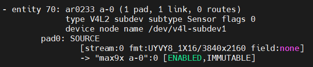

import CameraKitSupport from '@site/src/components/CameraKitSupport';

# AR0233

The onsemi AR0233 is an approximately 2.3 MP automotive image sensor with high dynamic range (HDR), capturing detail in scenes that mix bright and dark areas. In this configuration it is paired with a GW5300 GMSL serializer for transmission over long coax cables.

| Property | Value |
|----------|-------|
| Type | 2D color, HDR |
| Companion chip | GW5300 (GMSL serializer) |
| Vendor | Sensing |
| Interface | GMSL |
| IPU support | IPU6EPMTL, IPU75XA |

<CameraKitSupport camera="gmsl-ar0233" />

## Quick start

Complete the [GMSL bring-up steps](index.md#bring-up-a-gmsl-camera), using the sensor-specific values below.

| Parameter | Value |
|-----------|-------|
| Sensor I2C address | `0x6D` |
| Serializer (MAX9295) address | `0x40` |
| Configuration files | `config/ar0233/ipu6epmtl` or `config/ar0233/ipu75xa` |
| `icamerasrc` device name | `ar0233-1` |
| Tested resolution / format | 1920×1080, UYVY |

Once the pipeline is programmed and the configuration files are installed, preview the stream:

```bash
gst-launch-1.0 icamerasrc num-buffers=-1 num-vc=1 scene-mode=normal device-name=ar0233-1 printfps=true io-mode=dma_mode ! 'video/x-raw(memory:DMABuf),drm-format=UYVY,width=1920,height=1080' ! glimagesink sync=false
```

## Verify the pipeline

After programming the pipeline, `media-ctl -p` reports the AR0233's entities and links similar to this:


