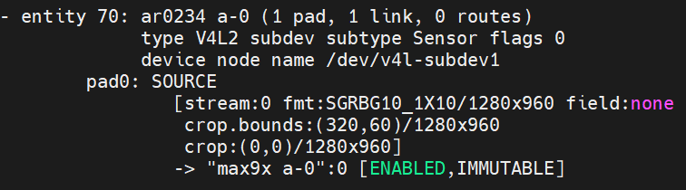

import CameraKitSupport from '@site/src/components/CameraKitSupport';

# AR0234 (GMSL)

The onsemi AR0234 is an approximately 2.3 MP **global shutter** sensor. A global shutter exposes the whole frame at once, so fast-moving objects are captured without distortion — useful for robots and moving machinery. This is the GMSL variant for long-cable mounting.

| Property | Value |
|----------|-------|
| Type | 2D color, global shutter |
| Vendor | D3 Embedded |
| Interface | GMSL |
| IPU support | IPU6EPMTL |

<CameraKitSupport camera="gmsl-ar0234" />

## Quick start

Complete the [GMSL bring-up steps](index.md#bring-up-a-gmsl-camera), using the sensor-specific values below.

| Parameter | Value |
|-----------|-------|
| Sensor I2C address | `0x10` |
| Serializer (MAX9295) address | `0x40` |
| Configuration files | `config/ar0234/ipu6epmtl` |
| `icamerasrc` device name | `ar0234-1` |
| Tested resolution / format | 1280×960, NV12 |

Once the pipeline is programmed and the configuration files are installed, preview the stream:

```bash
gst-launch-1.0 icamerasrc num-buffers=-1 num-vc=1 scene-mode=normal device-name=ar0234-1 printfps=true io-mode=dma_mode ! 'video/x-raw(memory:DMABuf),drm-format=NV12,width=1280,height=960' ! glimagesink sync=false
```

## Verify the pipeline

After programming the pipeline, `media-ctl -p` reports the AR0234's entities and links similar to this:


