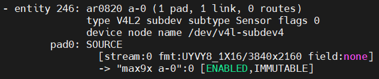

import CameraKitSupport from '@site/src/components/CameraKitSupport';

# AR0820

The onsemi AR0820 is an approximately 8.3 MP automotive image sensor with high dynamic range (HDR), offering higher resolution than the AR0233 for long-range forward views. It is paired with a GW5300 GMSL serializer for transmission over long coax cables.

| Property | Value |
|----------|-------|
| Type | 2D color, HDR, high-resolution |
| Companion chip | GW5300 (GMSL serializer) |
| Vendor | Sensing |
| Interface | GMSL |
| IPU support | IPU6EPMTL, IPU75XA |

<CameraKitSupport camera="gmsl-ar0820" />

## Quick start

Complete the [GMSL bring-up steps](index.md#bring-up-a-gmsl-camera), using the sensor-specific values below.

| Parameter | Value |
|-----------|-------|
| Sensor I2C address | `0x6D` |
| Serializer (MAX9295) address | `0x40` |
| Configuration files | `config/ar0820/ipu6epmtl` or `config/ar0820/ipu75xa` |
| `icamerasrc` device name | `ar0820-1` |
| Tested resolution / format | 3840×2160, UYVY |

Once the pipeline is programmed and the configuration files are installed, preview the stream:

```bash
gst-launch-1.0 icamerasrc num-buffers=-1 num-vc=1 scene-mode=normal device-name=ar0820-1 printfps=true io-mode=dma_mode ! 'video/x-raw(memory:DMABuf),drm-format=UYVY,width=3840,height=2160' ! glimagesink sync=false
```

## Verify the pipeline

After programming the pipeline, `media-ctl -p` reports the AR0820's entities and links similar to this:


