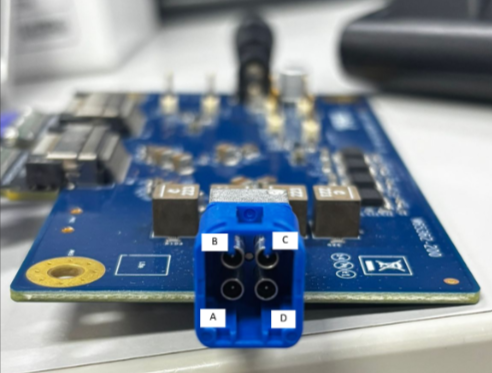
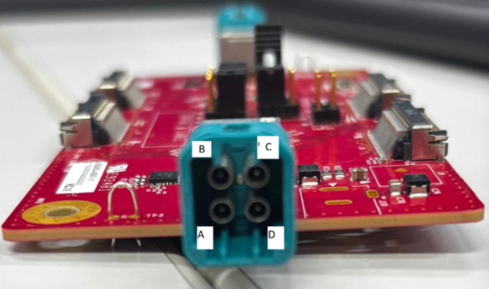
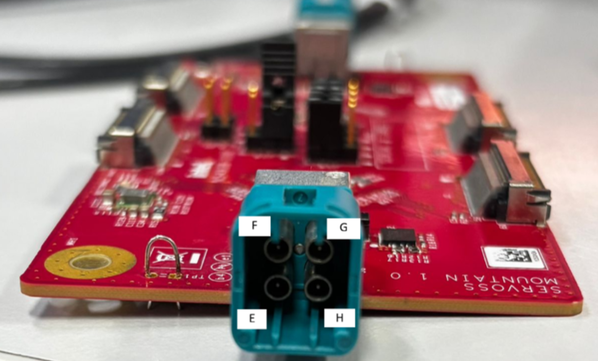
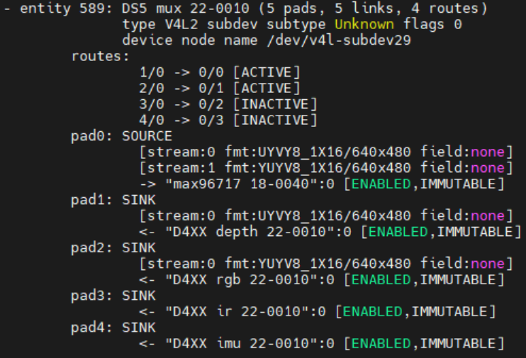

# GMSL

GMSL (Gigabit Multimedia Serial Link) cameras transmit uncompressed video over long cables with minimal latency. The camera's serializer packs its MIPI CSI-2 stream onto a single coax cable; a deserializer on the development kit unpacks it back into CSI-2 for the IPU. This makes GMSL ideal for multi-camera robots and autonomous machines where cameras are mounted meters away from the compute box.

## Supported cameras

The **[camera catalog](/docs/sensors/cameras)** lists every GMSL camera with its
type, vendor, and development-kit compatibility — filter it by interface or by
your kit. The individual GMSL cameras are also in the sidebar.

## Bring up a GMSL camera

These are the common steps to get any GMSL camera streaming. Each camera page lists the sensor-specific values (custom HID, I2C address, serializer address, `icamerasrc` device name, and a tested resolution/format) to plug into these steps.

### 1. Prerequisites

- The development kit running the supported Ubuntu release with the Intel kernel overlay installed.
- The IPU camera userspace stack installed for your platform: the camera firmware bins, the camera HAL, and the `icamerasrc` GStreamer plugin.
- A GMSL camera connected through its deserializer (for example MAX9296A or MAX96724) to the kit's GMSL input.

### 2. Build and install the sensor driver (DKMS)

The sensor and SerDes kernel modules are packaged with DKMS so they rebuild automatically against the running kernel:

```bash
sudo dkms remove ipu-camera-sensor/0.1 || true
sudo rm -rf /usr/src/ipu-camera-sensor-0.1/

sudo dkms add .
sudo dkms build -m ipu-camera-sensor -v 0.1
sudo dkms install -m ipu-camera-sensor -v 0.1 --force
```

### 3. Describe the camera topology to the platform (ACPI)

The kernel learns which sensor sits behind which deserializer link from an ACPI SSDT table. Compile the SSDT for your topology, stage it for boot, and reboot:

```bash
./gen_ssdt.sh <topology>.asl
sudo update-grub
sudo reboot
```

The SSDT encodes each deserializer, channel, serializer, and camera, along with the **serializer address** and **sensor I2C address** from the camera's page. On IPU6 platforms this wiring is set in the BIOS *MIPI Camera Configuration* menu instead; use the same per-camera addresses there.

> **Note:** A deserializer such as the MAX96724 exposes four internal pipes, so at most four streams can be active per deserializer at once.

Each deserializer link port maps to a sensor number that you later use in the `icamerasrc device-name` (for example link port **A** → sensor **1**). The numbering depends on the deserializer fitted to your kit:

For a MAX9296-based input:



For a MAX96724-based input:





### 4. Program the media pipeline

After reboot, program the media graph so the deserializer, CSI-2 receiver, and sensor are linked and formats propagate end to end. The development kit provides a setup script that discovers the GMSL topology from ACPI/sysfs and configures it with `media-ctl`:

```bash
sudo ./mc-setup.sh
```

Confirm the graph and note the assigned `/dev/videoN` nodes:

```bash
media-ctl -p
```

A correctly configured pipeline links the sensor, serializer, deserializer, CSI-2 receiver, and IPU entities, similar to this:



### 5. Install the camera configuration files

Copy the HAL configuration for your sensor and IPU version into `/etc/camera` (the exact path is on each camera's page):

```bash
sudo cp -r config/<sensor>/<ipu-version> /etc/camera
```

### 6. Verify the stream

Run a quick sanity capture on the node reported by `media-ctl -p`:

```bash
v4l2-ctl -d /dev/video0 --stream-mmap
```

For a live preview with the IPU pipeline, set up the GStreamer environment once per shell:

```bash
export DISPLAY=:0; xhost +
export GST_PLUGIN_PATH=/usr/lib/gstreamer-1.0
export LIBVA_DRIVER_NAME=iHD
rm -rf ~/.cache/gstreamer-1.0
```

Then run the camera's `icamerasrc` pipeline (see its page for the exact command and format).
