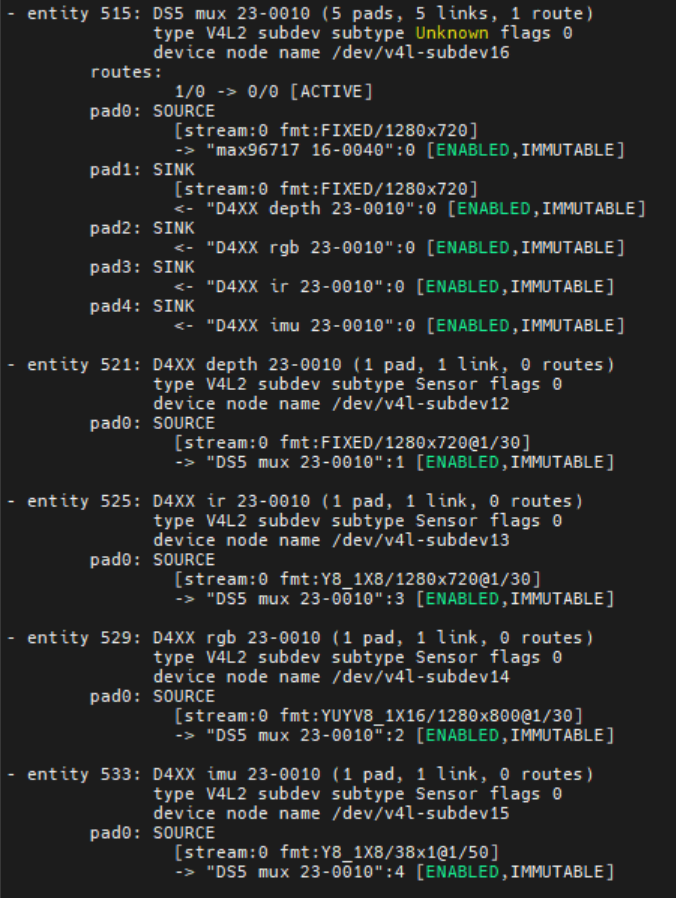

import CameraKitSupport from '@site/src/components/CameraKitSupport';

# Intel RealSense D457

The Intel® RealSense™ D457 is a **depth camera**: alongside a standard RGB image it produces a per-pixel depth map (distance to each point) and infrared streams. It uses stereo vision — two imagers spaced apart — to compute depth, which robots use for obstacle avoidance, mapping, and manipulation.

Unlike USB-based RealSense models, the D457 connects over **GMSL**, carrying its depth, color, and IR streams as MIPI CSI-2 through a deserializer into the development kit's IPU. This makes it suitable for long-cable, multi-camera robot builds where the depth camera is mounted away from the compute box.

## What it captures

| Stream | Description |
|--------|-------------|
| Depth | Per-pixel distance map derived from the stereo pair |
| Color (RGB) | Standard color image |
| Infrared | Raw left/right IR images used for the depth computation |

<CameraKitSupport camera="gmsl-d457" />

## Quick start

Complete the [GMSL bring-up steps](index.md#bring-up-a-gmsl-camera), using the sensor-specific values below.

| Parameter | Value |
|-----------|-------|
| ACPI HID | `INTC10CD` |
| Configuration files | `config/d4xx/ipu75xa` or `config/d4xx/ipu8` |
| `icamerasrc` device name | `d4xx-1` |
| Depth resolution / format | 640×480, UYVY |
| Color resolution / format | 640×480, YUY2 |

The D457 exposes its depth, color, and IR as separate video nodes. After `mc-setup.sh` runs, `media-ctl -p` reports which node is which. A deserializer drives up to four pipes, so by default two streams (depth + color) are enabled per camera.

Preview the depth and color streams on the nodes reported by `media-ctl -p` (depth is typically the first node, color the next):

```bash
gst-launch-1.0 v4l2src device=/dev/video0 ! 'video/x-raw,format=UYVY,width=640,height=480,framerate=30/1' ! glimagesink
gst-launch-1.0 v4l2src device=/dev/video4 ! 'video/x-raw,format=YUY2,width=640,height=480,framerate=30/1' ! glimagesink
```

> **Note:** A color stream can only start once a depth stream has been configured. If color fails to start, enable and briefly run the depth stream first.

## Verify the pipeline

After programming the pipeline, `media-ctl -p` reports the D457's entities and links similar to this:


