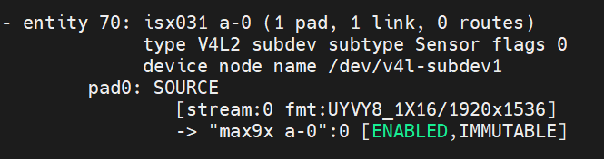

import CameraKitSupport from '@site/src/components/CameraKitSupport';

# ISX031 (GMSL)

The Sony ISX031 is an approximately 2.5 MP **global shutter** automotive sensor with high dynamic range (HDR) and LED-flicker mitigation. It captures fast motion without distortion while handling challenging lighting — a strong general-purpose choice for robotics and surround-view. This is the GMSL variant for long-cable mounting.

| Property | Value |
|----------|-------|
| Type | 2D color, HDR + global shutter |
| Vendor | D3 Embedded, Leopard Imaging, Sensing |
| Interface | GMSL |
| IPU support | IPU6EP, IPU6EPMTL, IPU75XA |

<CameraKitSupport camera="gmsl-isx031" />

## Quick start

Complete the [GMSL bring-up steps](index.md#bring-up-a-gmsl-camera), using the sensor-specific values below.

| Parameter | Value |
|-----------|-------|
| Sensor I2C address | `0x1a` |
| Serializer (MAX9295) address | `0x40` (Leopard Imaging: `0x62`) |
| Configuration files | `config/isx031/ipu6ep`, `config/isx031/ipu6epmtl`, or `config/isx031/ipu75xa` |
| `icamerasrc` device name | `isx031-1` |
| Tested resolution / format | 1920×1536, UYVY |

Once the pipeline is programmed and the configuration files are installed, preview the stream:

```bash
gst-launch-1.0 icamerasrc num-buffers=-1 num-vc=1 scene-mode=normal device-name=isx031-1 printfps=true io-mode=dma_mode ! 'video/x-raw(memory:DMABuf),drm-format=UYVY,width=1920,height=1536' ! glimagesink sync=false
```

## Verify the pipeline

After programming the pipeline, `media-ctl -p` reports the ISX031's entities and links similar to this:


