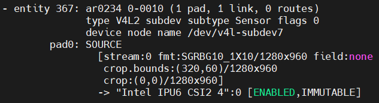

import CameraKitSupport from '@site/src/components/CameraKitSupport';

# AR0234 (MIPI CSI-2)

The onsemi AR0234 is an approximately 2.3 MP **global shutter** sensor. A global shutter exposes the whole frame at once, so fast-moving objects are captured without distortion — useful for robots and moving machinery. This is the MIPI CSI-2 variant for board-adjacent mounting.

| Property | Value |
|----------|-------|
| Type | 2D color, global shutter |
| Vendor | D3 Embedded |
| Interface | MIPI CSI-2 |
| IPU support | IPU6EPMTL |

<CameraKitSupport camera="mipi-ar0234" />

## Quick start

Complete the [MIPI CSI-2 bring-up steps](index.md#bring-up-a-mipi-csi-2-camera), using the sensor-specific values below.

| Parameter | Value |
|-----------|-------|
| BIOS custom HID | `INTC10C0` |
| Link frequency | 360 MHz |
| Sensor I2C address | `0x10` |
| Configuration files | `config/ar0234/ipu6epmtl` |
| `icamerasrc` device name | `ar0234-1` |
| Tested resolution / format | 1280×960, NV12 |

Once the sensor is configured in BIOS and the configuration files are installed, preview the stream:

```bash
gst-launch-1.0 icamerasrc num-buffers=-1 num-vc=1 scene-mode=normal device-name=ar0234-1 printfps=true io-mode=dma_mode ! 'video/x-raw(memory:DMABuf),drm-format=NV12,width=1280,height=960' ! glimagesink sync=false
```

## Verify the pipeline

After the sensor enumerates, `media-ctl -p` reports the AR0234's entities and links similar to this:


