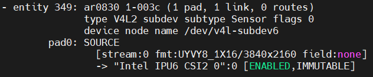

import CameraKitSupport from '@site/src/components/CameraKitSupport';

# AR0830

The onsemi AR0830 is an approximately 8.3 MP high-resolution sensor, bundled here with an AP1302 image signal processor (ISP) that performs exposure, white balance, and demosaicing on the camera module before the image reaches the host.

| Property | Value |
|----------|-------|
| Type | 2D color, high-resolution |
| Companion chip | AP1302 (on-module ISP) |
| Vendor | Leopard Imaging |
| Interface | MIPI CSI-2 |
| IPU support | IPU6EPMTL, IPU75XA |

<CameraKitSupport camera="mipi-ar0830" />

## Quick start

Complete the [MIPI CSI-2 bring-up steps](index.md#bring-up-a-mipi-csi-2-camera), using the sensor-specific values below.

| Parameter | Value |
|-----------|-------|
| BIOS custom HID | `LIAR0830` |
| Link frequency | 600 MHz |
| Sensor I2C address | `0x3C` |
| Configuration files | `config/ar0830/ipu6epmtl`, `config/ar0830/ipu75xa`, or `config/ar0830/ipu8` |
| `icamerasrc` device name | `ar0830-a` |
| Tested resolution / format | 3840×2160, UYVY |

Once the sensor is configured in BIOS and the configuration files are installed, preview the stream:

```bash
gst-launch-1.0 icamerasrc num-buffers=-1 scene-mode=normal device-name=ar0830-a printfps=true io-mode=dma_mode ! 'video/x-raw(memory:DMABuf),drm-format=UYVY,width=3840,height=2160' ! glimagesink sync=false
```

## Verify the pipeline

After the sensor enumerates, `media-ctl -p` reports the AR0830's entities and links similar to this:


