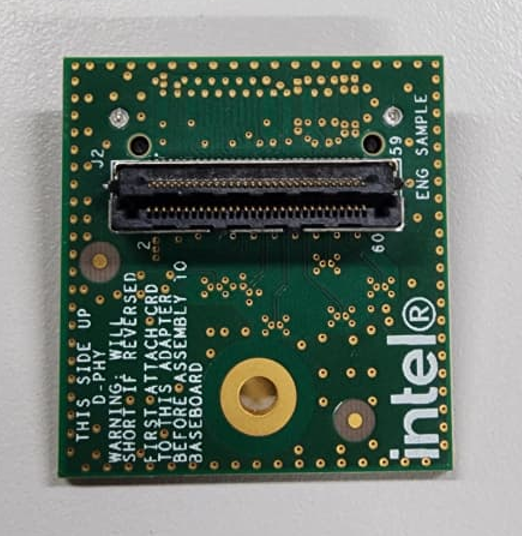
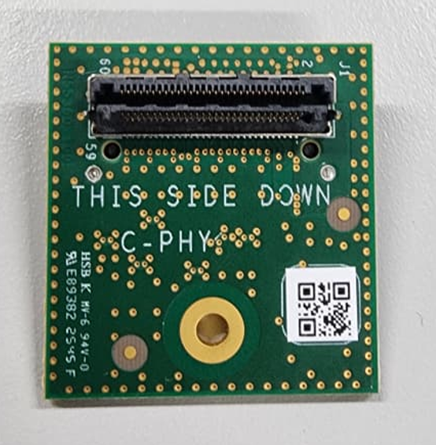

# MIPI CSI-2

MIPI CSI-2 (Camera Serial Interface 2) cameras connect directly to the development kit's CSI-2 connector over a short multi-lane cable, delivering high-bandwidth, low-latency video without an external serializer/deserializer. They are ideal for compact, board-adjacent camera placements.

## Supported cameras

The **[camera catalog](/docs/sensors/cameras)** lists every MIPI CSI-2 camera
with its type, vendor, and development-kit compatibility — filter it by interface
or by your kit. The individual MIPI cameras are also in the sidebar.

## Bring up a MIPI CSI-2 camera

These are the common steps to get any MIPI CSI-2 camera streaming. Each camera page lists the sensor-specific values (custom HID, link frequency, I2C address, `icamerasrc` device name, and a tested resolution/format) to plug into these steps. Unlike GMSL, there is no serializer/deserializer or topology script — the sensor is enumerated directly from ACPI.

### 1. Prerequisites

- The development kit running the supported Ubuntu release with the Intel kernel overlay installed.
- The IPU camera userspace stack installed for your platform: the camera firmware bins, the camera HAL, and the `icamerasrc` GStreamer plugin.
- The camera connected to the kit's CSI-2 connector with a ribbon cable.

### 2. Build and install the sensor driver (DKMS)

The sensor kernel module is packaged with DKMS so it rebuilds automatically against the running kernel:

```bash
sudo dkms remove ipu-camera-sensor/0.1 || true
sudo rm -rf /usr/src/ipu-camera-sensor-0.1/

sudo dkms add .
sudo dkms build -m ipu-camera-sensor -v 0.1
sudo dkms install -m ipu-camera-sensor -v 0.1 --force
```

### 3. Configure the camera in BIOS

In the BIOS *System Agent (SA) Configuration → MIPI Camera Configuration* menu, add the sensor as a **User Custom** camera using the values from its page:

- **Custom HID** — the sensor's ACPI identifier (for example `INTC113C`).
- **I2C Address** and **I2C Channel** — how the sensor is addressed on the bus.
- **Lanes / MIPI port** — the CSI-2 lane mapping for the connector you used.

Save and reboot. The kernel matches the HID to the sensor driver and the **link frequency** on each camera's page sets the CSI-2 data rate.

> **Note:** A C-PHY/D-PHY adapter board is required only when connecting a D-PHY sensor to a C-PHY port (for example on PTL). Connect the D-PHY sensor to the front of the adapter, and the rear of the adapter to the kit.





### 4. Install the camera configuration files

Copy the HAL configuration for your sensor and IPU version into `/etc/camera` (the exact path is on each camera's page):

```bash
sudo cp -r config/<sensor>/<ipu-version> /etc/camera
```

### 5. Verify the stream

Confirm the sensor enumerated and note its `/dev/videoN` node:

```bash
media-ctl -p
v4l2-ctl -d /dev/video0 --stream-mmap
```

For a live preview with the IPU pipeline, set up the GStreamer environment once per shell:

```bash
export DISPLAY=:0; xhost +
export GST_PLUGIN_PATH=/usr/lib/gstreamer-1.0
export LIBVA_DRIVER_NAME=iHD
rm -rf ~/.cache/gstreamer-1.0
```

Then run the camera's `icamerasrc` pipeline (see its page for the exact command and format).
