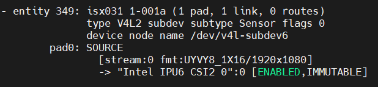

import CameraKitSupport from '@site/src/components/CameraKitSupport';

# ISX031 (MIPI CSI-2)

The Sony ISX031 is an approximately 2.5 MP **global shutter** automotive sensor with high dynamic range (HDR) and LED-flicker mitigation. It captures fast motion without distortion while handling challenging lighting — a strong general-purpose choice for robotics. This is the MIPI CSI-2 variant for board-adjacent mounting.

| Property | Value |
|----------|-------|
| Type | 2D color, HDR + global shutter |
| Vendor | D3 Embedded, Sensing |
| Interface | MIPI CSI-2 |
| IPU support | IPU6EP, IPU6EPMTL, IPU75XA |

<CameraKitSupport camera="mipi-isx031" />

## Quick start

Complete the [MIPI CSI-2 bring-up steps](index.md#bring-up-a-mipi-csi-2-camera), using the sensor-specific values below.

| Parameter | Value |
|-----------|-------|
| BIOS custom HID | `INTC113C` |
| Link frequency | 300 MHz |
| Sensor I2C address | `0x1a` |
| Configuration files | `config/isx031/ipu6ep`, `config/isx031/ipu6epmtl`, or `config/isx031/ipu75xa` |
| `icamerasrc` device name | `isx031-a` |
| Tested resolution / format | 1920×1536, UYVY |

Once the sensor is configured in BIOS and the configuration files are installed, preview the stream:

```bash
gst-launch-1.0 icamerasrc num-buffers=-1 num-vc=1 scene-mode=normal device-name=isx031-a printfps=true io-mode=dma_mode ! 'video/x-raw(memory:DMABuf),drm-format=UYVY,width=1920,height=1536' ! glimagesink sync=false
```

## Verify the pipeline

After the sensor enumerates, `media-ctl -p` reports the ISX031's entities and links similar to this:


