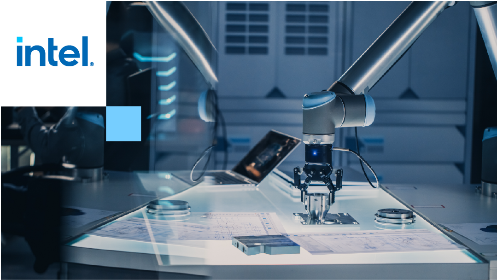

<link rel="stylesheet" type="text/css" href="_static/css/style_home_section_tiles.css">

# Robotics AI Suite

Edge AI Suites are collections of open, industry-specific AI software
development kits (SDKs), microservices, and sample applications for independent
software vendors (ISVs), system integrators and solution builders.

The Robotics AI Suite is an open-source toolkit for developing robots that sense,
interact, and make decisions at the edge. Built on a unified Intel platform, the
Suite combines modular tools for vision, control, and AI inference, accelerating
integration and deployment.

Whatever your robotics workload - if you are bringing up a new platform,
integrating sensors and actuators, or optimizing an AI workload with Intel -
these documents help you find compatible ingredients and pipelines for your
robotics application and guidance for deploying on Intel hardware.

:::{image} ./images/intro-light.png
:class: only-light
:::

:::{image} ./images/intro-dark.png
:class: only-dark
:::

## Robot Form Factors

The Robotics AI Suite targets the following robot form factors:

- **[Autonomous Mobile Robot](./hardware_blueprints/amr/index.md)**\
  — Wheeled or tracked robots that navigate dynamic environments without fixed
  guidance, using onboard sensing, mapping, and path planning. Common in
  warehouse logistics, material transport, inspection, and last-mile delivery.

- **[Humanoid](./hardware_blueprints/humanoid/index.md)**\
  — Human-shaped robots with articulated limbs designed to operate in spaces and
  with tools built for people. Used for manipulation, locomotion, and interactive
  tasks in service, research, and general-purpose automation.

- **[Stationary Arm](./hardware_blueprints/stationary_arm/index.md)**\
  — Fixed-base robotic manipulators that perform precise, repeatable operations
  within a defined workspace. Typical applications include pick-and-place,
  assembly, welding, and machine tending on production lines.

## Explore Intel® Robotics Ecosystem

[Scale Enablement - Robotics Builders Community | Intel(R) Industry Solution Builders](https://builders.intel.com/communities/robotics/scale)

Explore robotics Scale Enablement and discover how Intel's ecosystem and experts help accelerate robotics solutions from design to deployment.

[Edge AI Partner Spotlight - Solution Hub | Intel(R) Industry Solution Builders](https://builders.intel.com/ecosystem-engagement/solution-hub/edge-ai-catalog/partner-spotlight?cp=53&cid=202&type=system)

Browse our curated catalog of Intel-powered Edge AI systems and applications, delivering real-time innovation, efficiency, and intelligence to your business.

## Next Steps

Continue to the System Requirements guide to learn about supported Intel processors, OS requirements, and development kits:

- **[System Requirements](./platform_foundation/system_requirements.md)** — select a platform and install an OS distribution.

:::{toctree}
:caption: Platform Foundation
:hidden:

System Requirements <platform_foundation/system_requirements.md>
Getting Started <platform_foundation/getting_started.md>
:::

:::{toctree}
:caption: Components
:hidden:

Intel® Optimized Robotics Components <components/optimized_solutions/index>
Real-time Determinism <components/realtime_determinism/index>
Benchmarking <components/benchmarking/index>
Security <components/security/index>
Middleware <components/middleware/index>
Virtualization <components/virtualization/index>
Sensors <components/sensors/index>
:::

:::{toctree}
:caption: AI Resources
:hidden:

Intel® Powered AI <ai_resources/intel_powered_ai>
OpenVINO <ai_resources/openvino/index>
Developer Tools <ai_resources/developer_tools/index>
AI Skills <ai_resources/skills/index>
OpenVINO™ Physical AI <ai_resources/openvino/openvino_physical_ai_runtime>
Physical AI Studio  <ai_resources/physical_ai_studio>
Geti <ai_resources/developer_tools/geti>
:::

:::{toctree}
:caption: Hardware Blueprints
:hidden:

Hardware Blueprints <hardware_blueprints/index>
Autonomous Mobile Robot <hardware_blueprints/amr/index>
Humanoid Robot <hardware_blueprints/humanoid/index>
Stationary Arm <hardware_blueprints/stationary_arm/index>
:::

:::{toctree}
:caption: Resources
:hidden:

Release Notes <resources/release-notes.md>
Autonomous Mobile Robot <software_references/amr/index>
Humanoid Robot <software_references/humanoid/index>
Stationary Arm <software_references/stationary_arm/index>
Software Index <resources/index>
Heterogeneous Computing <resources/heterogeneous_computing.md>
Troubleshooting <resources/troubleshooting.md>
Glossary <resources/glossary.md>
Get Help or Contribute <https://docs.openedgeplatform.intel.com/dev/OEP-articles/contribution-guide.html>
Hack-a-thon Resources <resources/hackathon_resources.md>
:::
