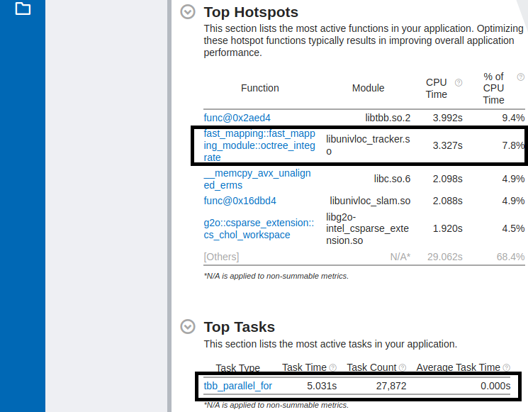
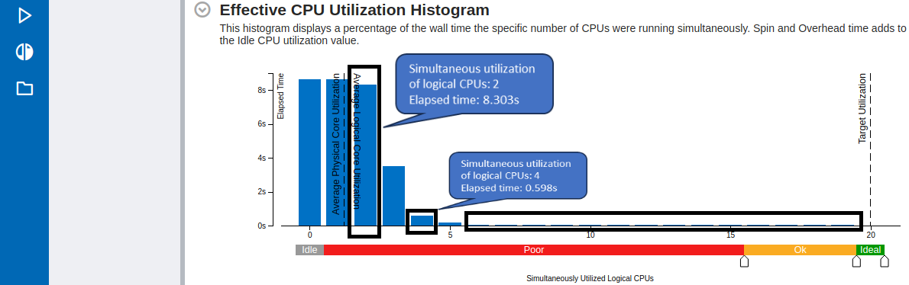
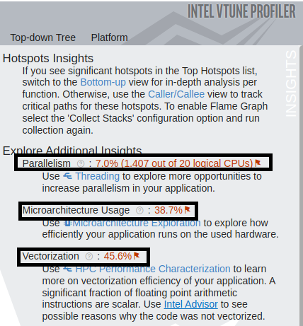
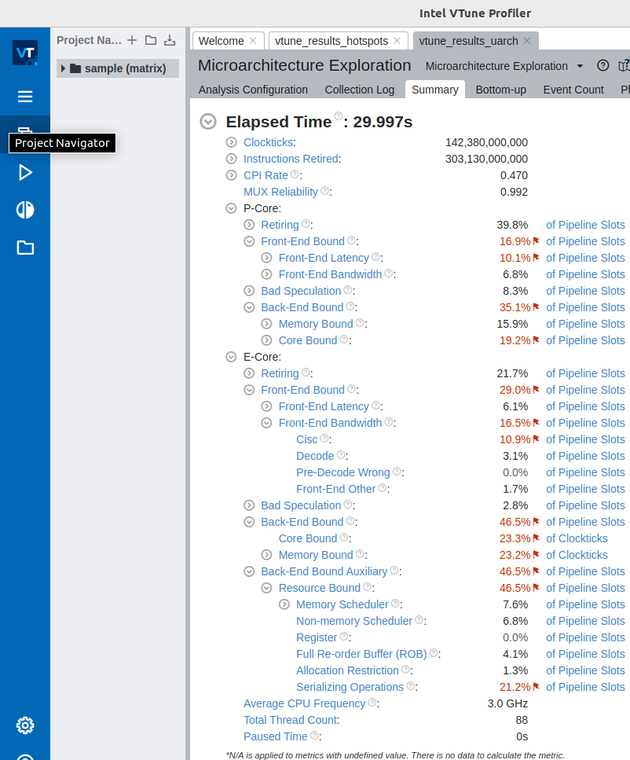
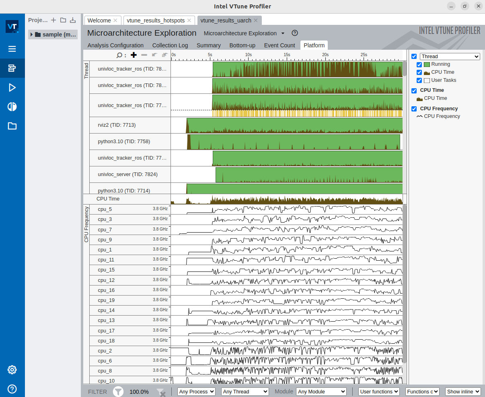

# VTune™ Profiler for CPU and GPU profiling

## Overview

VTune™ Profiler is a performance analysis tool for applications and
systems, which helps in analyzing and optimizing the application
performance, system performance and system configuration. The profiling
can be executed on a CPU, GPU or FPGA. It can profile both
single-threaded as well as multi-threaded applications. Refer the
[Get Started with VTune™ Profiler](https://www.intel.com/content/www/us/en/docs/vtune-profiler/get-started-guide/2024-0/overview.html)
for more details on VTune™ Profiler.

## Installation of VTune™ Profiler

Follow the
[VTune™ Profiler installation guide](https://www.intel.com/content/www/us/en/docs/vtune-profiler/installation-guide/2023-1/overview.html)
to install VTune™ Profiler by choosing one of the following two options:

- [Get the Intel® oneAPI Base Toolkit](https://www.intel.com/content/www/us/en/developer/tools/oneapi/base-toolkit-download.html)
- [Get the VTune™ Profiler](https://www.intel.com/content/www/us/en/developer/tools/oneapi/vtune-profiler-download.html)

## Additional System Setup for CPU and GPU Profiling

1. Build and Install the Sampling Drivers for Linux Targets.

   To do CPU and GPU profiling using driverless sampling collection on
   processors based on Intel® Performance Hybrid Architecture, which
   has been introduced from 12th Gen Intel® Core™ processors, the
   VTune™ Profiler sampling drivers must be installed and loaded using
   root credentials. Follow the steps to
   [Build and Install the Sampling Drivers for Linux Targets](https://www.intel.com/content/www/us/en/docs/vtune-profiler/user-guide/2024-0/build-install-sampling-drivers-for-linux-targets.html).

2. System setup for CPU and GPU profiling.

   As described in
   [Set Up System for GPU Analysis](https://www.intel.com/content/www/us/en/docs/vtune-profiler/user-guide/2024-0/set-up-system-for-gpu-analysis.html),
   to analyze Intel® HD and Intel® Iris Graphics hardware events, the
   profiler requires that the "Intel Metric Discovery(MD) API"
   Library is installed and that the necessary permissions to enable
   the collecting of GPU hardware metrics.

   - Refer to
     [Set Up System for GPU Analysis](https://www.intel.com/content/www/us/en/docs/vtune-profiler/user-guide/2024-0/set-up-system-for-gpu-analysis.html),
     to build and install the Intel Metric Discovery(MD) API Library.

   - Run the following command to grant the relevant permission needed to
     collect GPU hardware metrics for non-privileged users.

     ```bash
     sudo sysctl -w dev.i915.perf_stream_paranoid=0
     ```

   - Run the following command to remove the limited scope of the
     "ptrace()" system call.

     ```bash
     sudo sysctl -w kernel.yama.ptrace_scope=0
     ```

   - Run the following command to disallow raw tracepoint access to
     unprivileged users.

     ```bash
     sudo sysctl -w kernel.perf_event_paranoid=0
     ```

   - Run the following command to remove the restrictions placed on
     exposing kernel addresses via /proc and other interfaces.

     ```bash
     sudo sysctl -w kernel.kptr_restrict=0
     ```

   - Run the following command to add the user to the video and render
     groups.

     ```bash
     sudo usermod -a -G video $USER
     sudo usermod -a -G render $USER
     ```

## Profiling an Application from Autonomous Mobile Robot

The example application from Autonomous Mobile Robot considered for the
CPU and GPU profiling is the "Collaborative visual slam with
fastmapping enabled" application from the
[Collaborative Visual SLAM](../../components/optimized_solutions/collaborative-slam.md)
tutorial. The two CPU analyses types considered in this
example are `CPU Hotspots` analysis and
`CPU Microarchitecture Exploration` analysis. Furthermore, the GPU
analysis type considered is `GPU Offload` analysis. The CPU and GPU
profiling are carried out using the `vtune` command line tool. However,
the `vtune-gui` tool is later used to visualize and understand the
findings.

### CPU Profiling

#### CPU Hotspots Analysis

The CPU Hotspots Analysis is carried out with the following parameters:

- Hardware sampling enabled with sampling interval of 5ms.
- Stack collection enabled with stack size of 2048B.
- The application is called directly by the profiler.
- The profiler runs and profiles the application for 30 seconds and
  terminates the application.

##### Steps to run CPU Hotspots Analysis

1. Install the "Collaborative visual slam with fastmapping enabled"
   application from the
   [Collaborative Visual SLAM](../../components/optimized_solutions/collaborative-slam.md)
   tutorial.

2. Run the following command to source the ROS 2 setup files.

   ::::{tab-set}
   :::{tab-item} **Jazzy**
   :sync: jazzy

   ```bash
   source /opt/ros/jazzy/setup.bash
   ```

   :::
   :::{tab-item}  **Humble**
   :sync: humble

   ```bash
   source /opt/ros/humble/setup.bash
   ```

   :::
   ::::

3. Run the following command to set `ROS_DOMAIN_ID`.

   ```bash
   export ROS_DOMAIN_ID=67
   ```

4. Run the following command to source the VTune environment.

   ```bash
   source /opt/intel/oneapi/vtune/latest/env/vars.sh
   ```

5. Run the following command in the terminal to start the CPU Hotspots
   analysis of the "Collaborative visual slam with fastmapping
   enabled" application from the
   [Collaborative Visual SLAM](../../components/optimized_solutions/collaborative-slam.md)
   tutorial.

   ::::{tab-set}
   :::{tab-item} **Jazzy**
   :sync: jazzy

   ```bash
   vtune -collect hotspots -knob sampling-mode=hw -knob sampling-interval=5 -knob enable-stack-collection=true -knob stack-size=2048 -duration=30 -result-dir ./vtune_results_hotspots /opt/ros/jazzy/share/collab-slam/tutorial-fastmapping/cslam-fastmapping.sh
   ```

   :::
   :::{tab-item}  **Humble**
   :sync: humble

   ```bash
   vtune -collect hotspots -knob sampling-mode=hw -knob sampling-interval=5 -knob enable-stack-collection=true -knob stack-size=2048 -duration=30 -result-dir ./vtune_results_hotspots /opt/ros/humble/share/collab-slam/tutorial-fastmapping/cslam-fastmapping.sh
   ```

   :::
   ::::

The results are collected in `vtune_results_hotspots` directory.

> [!NOTE]
>
> The sampling interval and the duration can be changed by adapting the
> value of the parameters `-sampling-interval` and `-duration`
> respectively.

##### Analysis of the CPU Hotspots Results

After the CPU Hotspots Analysis results are saved, open the `vtune-gui`
by running the following command.

```bash
vtune-gui
```

Now click on the `open-results` button on the left side of the tool,
browse to the directory `vtune_results_hotspots`, select the
`vtune_results_hotspots.vtune` file and click on `open`. This will open
the CPU Hotspots Analysis results for the "Collaborative visual slam
with fastmapping enabled" application from the
[Collaborative Visual SLAM](../../components/optimized_solutions/collaborative-slam.md)
tutorial which ran for 30 seconds.

From the summary page, some of the CPU Hotspots Analysis details that
can be observed are mentioned below. Refer to the page,
[Run and Interpret Hotspots Analysis](https://www.intel.com/content/www/us/en/docs/vtune-profiler/tutorial-common-bottlenecks-linux/2020/run-and-interpret-hotspots-analysis.html),
for more details on the CPU Hotspots Analysis using VTune™ Profiler.

###### Top Hotspots and the Top Tasks

The following picture shows the most active functions in the
application, the total CPU time it has run, and the percentage of CPU time
it has utilized. For example, in this case, the "Collaborative visual slam
with fastmapping enabled" application from the
[Collaborative Visual SLAM](../../components/optimized_solutions/collaborative-slam.md)
tutorial shows that the function
`fast_mapping::fast_mapping_module::octree_integrate` is the second most
active function, consuming 7.8% of CPU time. The top running task is
`tbb_parallel_for` with a task time of 5.031 seconds and a task count of
27,872, as shown in the "Task Count" column.



###### Effective CPU Utilization Histogram

The following histogram shows the effective CPU core utilization when the
application is running. From the picture below it can be observed that
the effective elapsed time wherein two logical CPU cores are utilized is
slightly above 8 seconds. On the other hand, the effective elapsed time
wherein four logical CPU cores are utilized is slightly greater than 0.5
seconds. It can also be observed that at no time six or more logical CPU
cores are utilized simultaneously.



###### Additional Insights

Under "Explore Additional Insights" section, an overview of the
following can be observed. This will encourage to further explore the
relevant analysis types which further helps in the optimization of the
application.

- Parallelism: On an average how many CPUs out of total available CPUs
  were utilized. Here 1.407 out of available 20 logical CPUs were
  utilized.
- Microarchitecture usage: This gives an estimate (in %) on how
  effectively the application has utilized the underlying hardware
  architecture.



#### CPU Microarchitecture Exploration

The CPU Microarchitecture Exploration is carried out with the following
parameters:

- Hardware sampling enabled with sampling interval of 5ms.
- The application is called directly by the profiler.
- The profiler runs and profiles the application for 30 seconds and
  terminates the application.

##### Steps to run CPU Microarchitecture Exploration

1. Install the "Collaborative visual slam with fastmapping enabled"
   application from the
   [Collaborative Visual SLAM](../../components/optimized_solutions/collaborative-slam.md)
   tutorial.

2. Run the following command to source the ROS 2 setup files.

   ::::{tab-set}
   :::{tab-item} **Jazzy**
   :sync: jazzy

   ```bash
   source /opt/ros/jazzy/setup.bash
   ```

   :::
   :::{tab-item}  **Humble**
   :sync: humble

   ```bash
   source /opt/ros/humble/setup.bash
   ```

   :::
   ::::

3. Run the following command to set `ROS_DOMAIN_ID`.

   ```bash
   export ROS_DOMAIN_ID=67
   ```

4. Run the following command to source the VTune environment.

   ```bash
   source /opt/intel/oneapi/vtune/latest/env/vars.sh
   ```

5. Run the following command in the terminal to start the CPU
   microarchitecture exploration of the "Collaborative visual slam
   with fastmapping enabled" application from the
   [Collaborative Visual SLAM](../../components/optimized_solutions/collaborative-slam.md)
   tutorial.

   ::::{tab-set}
   :::{tab-item} **Jazzy**
   :sync: jazzy

   ```bash
   vtune -collect uarch-exploration -knob sampling-interval=5 -duration=30 -result-dir=./vtune_results_uarch /opt/ros/jazzy/share/collab-slam/tutorial-fastmapping/cslam-fastmapping.sh
   ```

   :::
   :::{tab-item}  **Humble**
   :sync: humble

   ```bash
   vtune -collect uarch-exploration -knob sampling-interval=5 -duration=30 -result-dir=./vtune_results_uarch /opt/ros/humble/share/collab-slam/tutorial-fastmapping/cslam-fastmapping.sh
   ```

   :::
   ::::

The results are collected in `vtune_results_uarch` directory.

> [!NOTE]
>
> The sampling interval and the duration can be changed by adapting the
> value of the parameters `sampling-interval` and `-duration`
> respectively.

##### Analysis of the CPU Microarchitecture Exploration results

After the CPU Microarchitecture Exploration results are saved, open the
`vtune-gui` by running the following command.

```bash
vtune-gui
```

Now click on the `open-results` button on the left side of the tool,
browse to the directory `vtune_results_uarch`, select the
`vtune_results_uarch.vtune` file and click on `open`. This will open the
CPU Microarchitecture Exploration results for the "Collaborative visual
slam with fastmapping enabled" application from the
[Collaborative Visual SLAM](../../components/optimized_solutions/collaborative-slam.md)
tutorial which ran for 30 seconds.

From the summary page, some of the CPU Microarchitecture Exploration
details that can be observed are mentioned below. Refer to the
[Analyze Microarchitecture Usage](https://www.intel.com/content/www/us/en/docs/vtune-profiler/tutorial-common-bottlenecks-linux/2020/analyze-microarchitecture-usage.html)
page for more details on the CPU Microarchitecture Exploration using VTune™
Profiler.

###### P-core and E-core execution summary

The following picture shows the execution summary of the application
running on P-cores and E-cores. It provides an overview of the percentage
of retired instructions on P-cores and E-cores, the percentage of slots
spent waiting for front-end and back-end bound latencies on each core type,
and other parameters that compare the tasks executing on P-cores and E-cores.



###### CPU Bandwidth utilization

Click the `Platform` tab to view CPU bandwidth utilization. The following
picture shows CPU bandwidth usage by different threads in the running
application.


